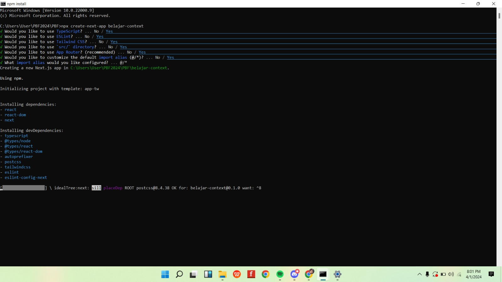
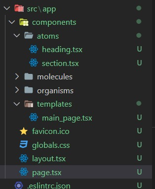
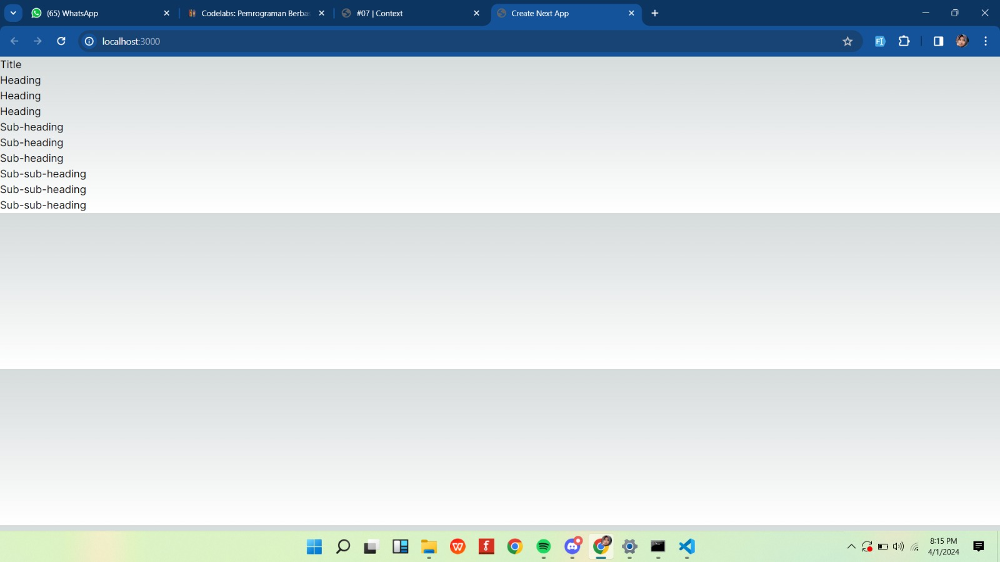
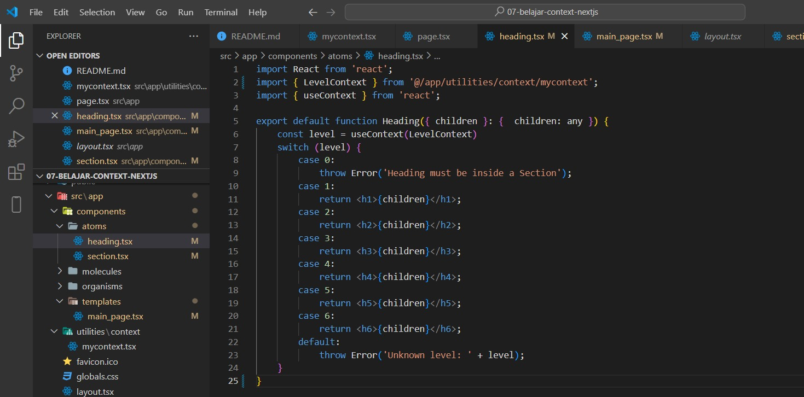
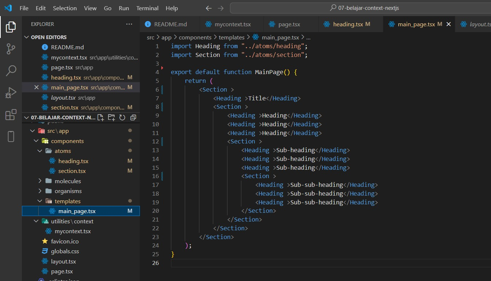
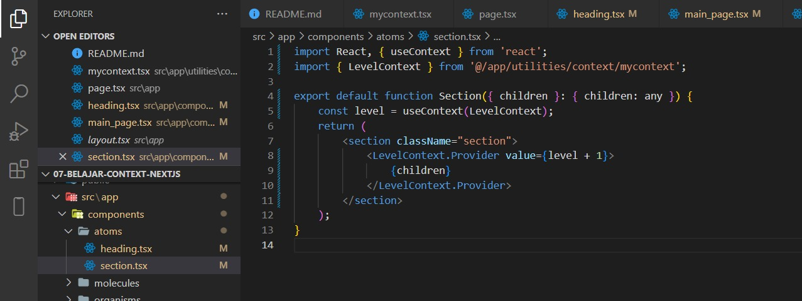
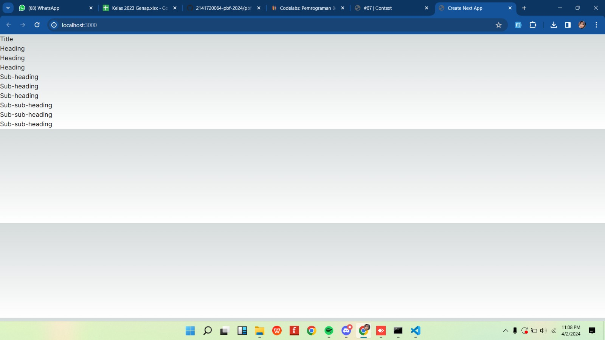

Nama    : Hadian Nelvi
Kelas   : TI-3C
Nim     : 

Prakktikum 1 : Membuat Variasi Ukuran Teks Heading dengan context

Langakah 1 : Buat project baru dan repo baru di github 

Langkah 2 : Buat Struktur Folder dengan prinsip atomic design

Pada langkah ke 2 ini saya mengiinput kode yang sesuai dengan panduan praktikum.

Soal 1
Capture hasilnya dan buatlah laporan di README.md. Jelaskan apa yang telah Anda pelajari dan bagaimana tampilannya saat ini?

Dengan menggunakan atomic design ini, struktur penulisan kode untuk sintaks lebih mudah digunakan dan untuk component yang memiliki struktur yang mirip ataupun class yang sama dapat menggunakan function component yang sudah dibuat tanpa harus menulis kode yang sama berulang kali, sehinga lebih meudahkan dalam penulisan kode atau pemangilan kode berikutnya . hanya perlu memasukkan parameter untuk kedinamisan tampilkan yang dihasilkan dari kode yang dibuat. Tampilan laman yang ditampilkan dapat seperti hasil dari kode html yang umum digunakan, dengan variasi penggunaan heading.

Langkah 3 :Buat dan gunakan Contect

Langkah 4 : Sediakan Contect

Soal no 2 :

Meneruskan suatu value dapat dilakukan dengan menggunakan context, sehingga child hanya perlu mengakses value dari node atas terdekat atau parent, tanpa perlu diberi value untuk masing-masing child. Meskipun menggunakan context, tampilan laman yang dihasilkan masih sama seperti sebelumnya.

Langkah 5: Menggunakan dan menyediakan context dari komponen yang sama

Soal No 3:

Selain dapat membagikan value ke child secara manual, context dapat mengirimkan data dengan operasi atau pola yang sama, seperti pada langkah keenam ini, dapat dilakukan pengiriman value secara auto increment, namun perbedaan tampilan saat ini adalah, ukuran font lebih kecil, dikarenakan dengan value default 1, maka saat sampai ke child nya sudah dilakukan penambahan.

