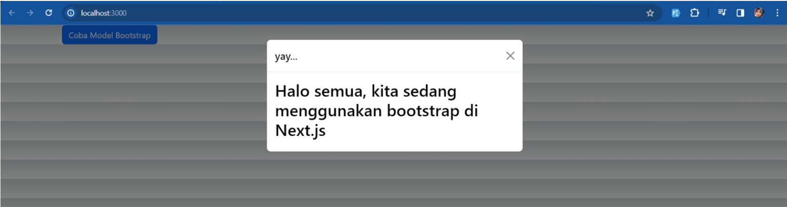
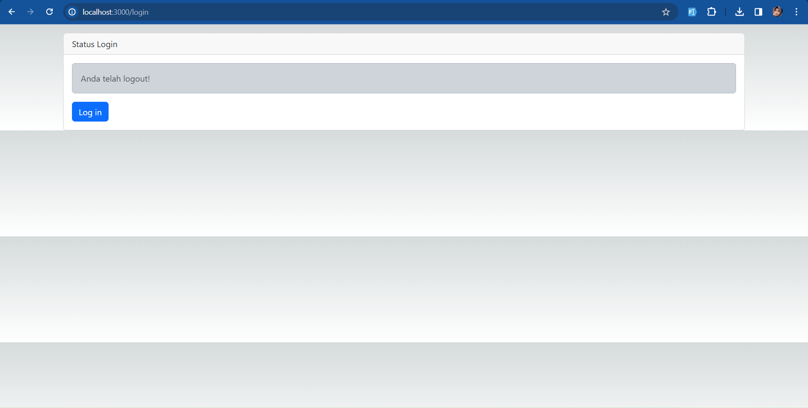
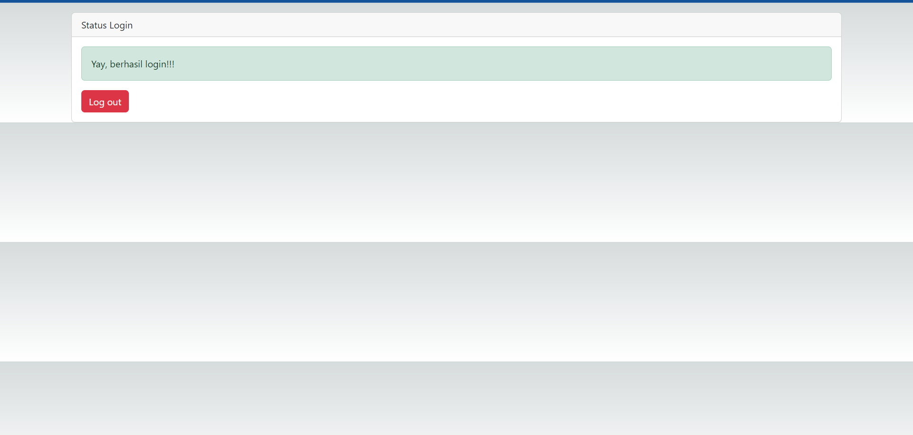
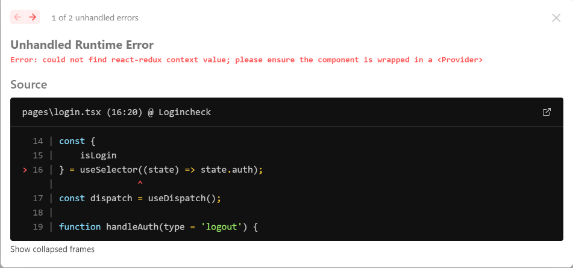

Nama    : Hadian Nelvi
Nim     :
Kelas   : TI-3C

LAPORAN PRAKTIKUM 6

Praktikum1

=> Bootstrap berhasil diterapkan dan class yang disediakan oleh bootstrap dapat dipakai pada nextJs dengan mengikuti langkah-langkah yang telah dijelaskan.

Praktikum2

Terjadi error karena menurut saya pada authSlice terdapat initialState isLogin: false di mana hasilnya jika ke /login maka memang di set ke anda telah logout. Nah kerana kita pencet login dan kita berada di state di mana islogin pada local storage menjadi true, lalu direfresh

soal ke 2

kalau tidak mengunakan parse tidak bisa. karena ,tujuan dari parse adalah untuk mengkonversi baris html menjadi javascript. Karena biasanya java script mengguanakan className sedangkan ini hanya menggunakan class. Lalu jika tidak memakai parse terdapat error jsx harus punya parent class yang dimana tidak dapat digunakan di ternary operation seperti ini, jadi menggunakan parse merupakan langkah yang baik dan efektif serta efisien.

Jawaban soal 