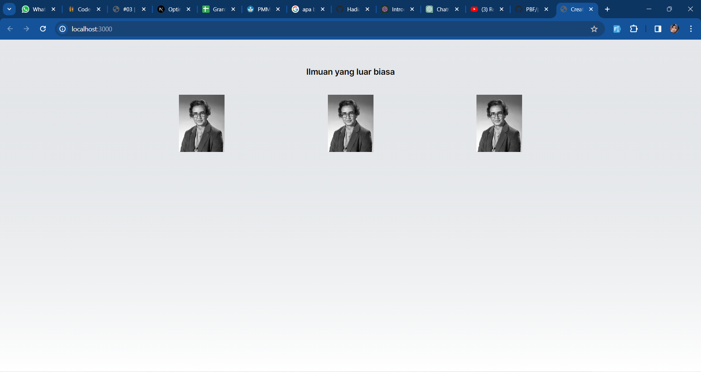
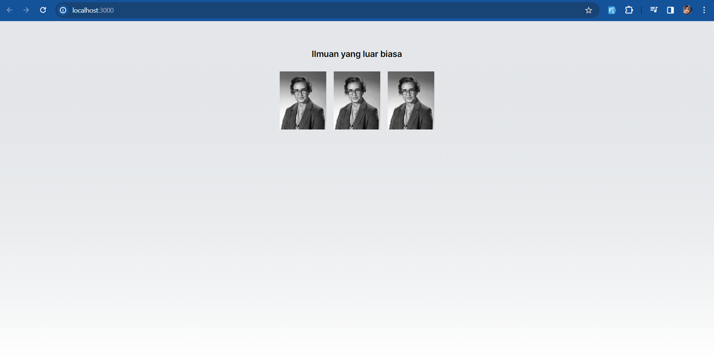
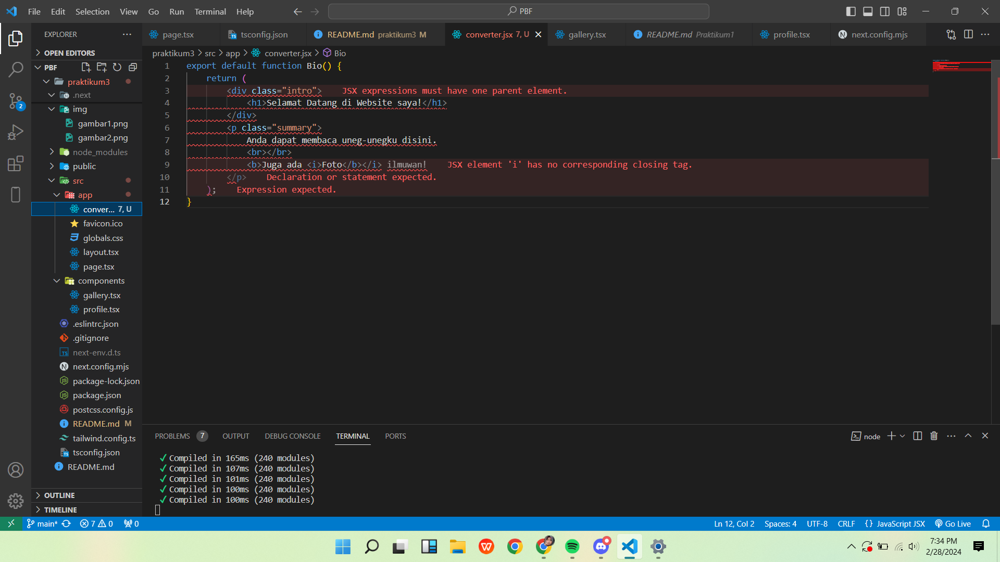
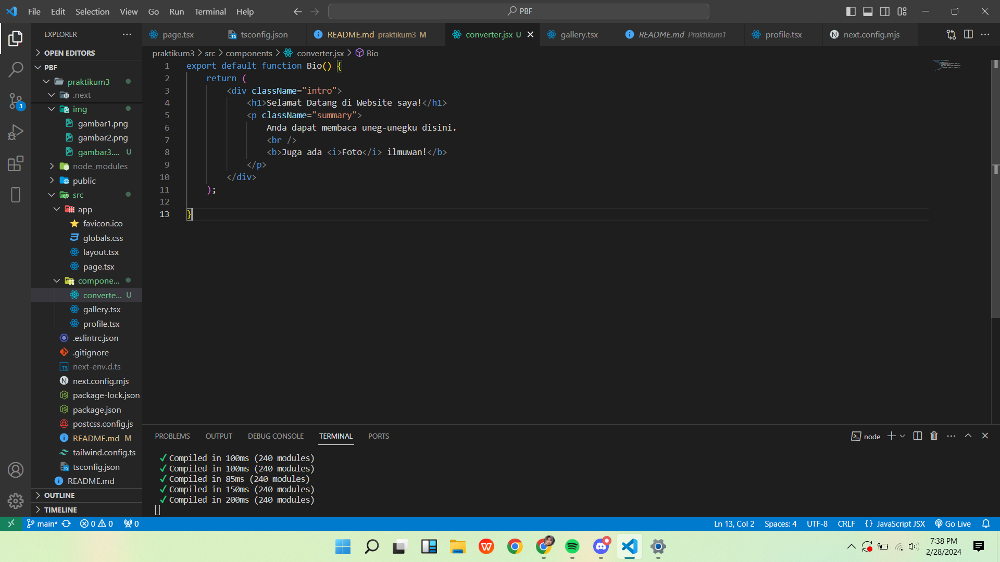
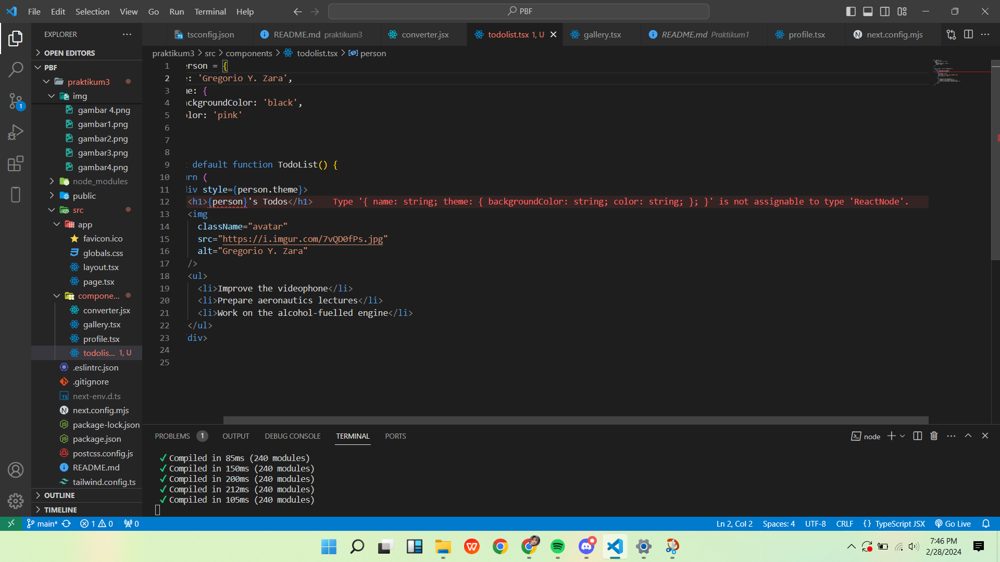
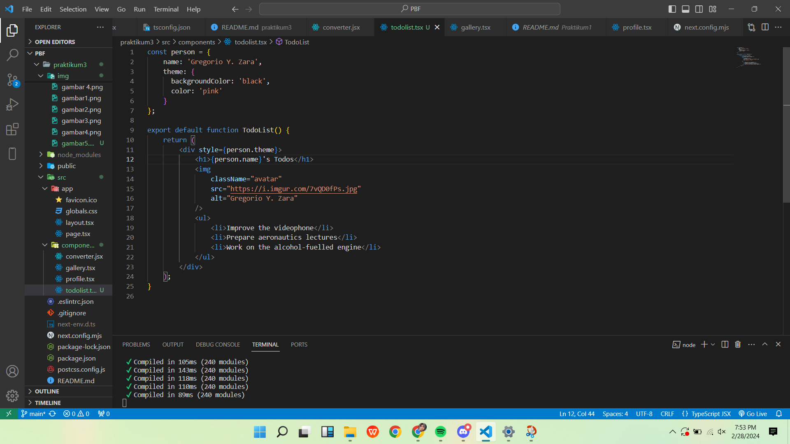
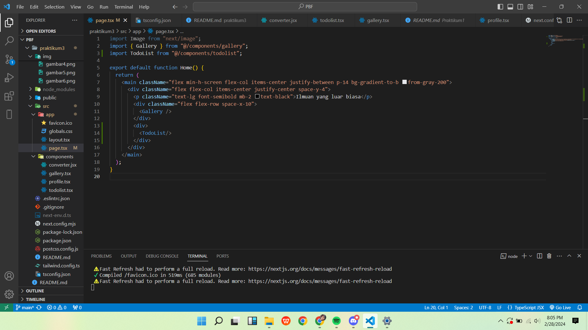
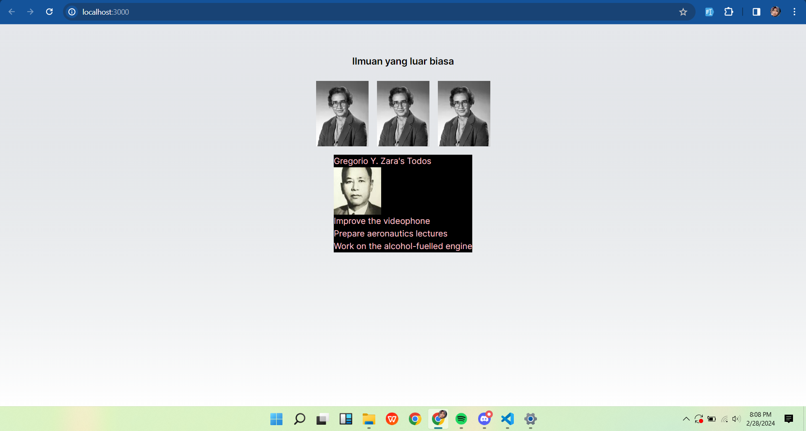

Nama    : Hadian Nelvi
Nim     : 2341728025

Pada Soal Pertama ini saya melakukan bebrapa step untuk mendapatkan hasil yang sesuai dengan perintah modul

=> Yang dapat saya pelajari adalah untuk memangil gambar ini saya harus membuat components terlebih dahulu . di dalam components ini saya membuat file profile.tsx .setelah itu  components ini dapat di panggil pada halaman page.tsx tanpa mengimput kode yang panjang cukup panggil components profile tadi. selain itu ada yang harus di modif juga di bagian next.config.mjs nya yaitu menjadi 

/** @type {import('next').NextConfig} */
const nextConfig = {
    reactStrictMode: true,
    images: {
      domains: ['i.imgur.com'],
    },
  };

  export default nextConfig;

Pada Soal No 2 saya mendapatkan hasil yang sama dengan percobaan pertama hanya saja ini cara mendapatkan hasilnya berbeda

Penjelasan :
-> disini saya membuat file baru di component dengan nama gallery.tsx yang mana fungsinya untuk mengimpor dan merender beberapa instansi dari komponen Profile.

-> disini saya juga File page.tsx dan menempatkan komponen <Gallery /> di dalam fungsi Home, yang kemudian akan dirender di halaman.

->untuk next.config.mjs tetap sama dengan praktikum pertama dan tidak ada yang diubah

Pada Soal No 3 ini
saya membuat file baru bernama convert.jsx dan saya input kode yang ada di petunjuk laporan ketika diinputkan ada beberapa eror yang muncul yaitu:

setelah  beberapa kali percobaan saya berhasil menyelsaikan erornya menjadi :

Pada soal No 4 saya mendapat eror seperti ini:

dan saya perbaiki menjadi seperti ini:

perbaikan yang say lakukan di bagian elemen h1, saya menggunakan properti name dari objek person untuk menampilkan nama orang tersebut. Hal ini memastikan bahwa hanya nama orang tersebut yang akan dicetak, bukan seluruh objek person.

Pada soal No 5 saya mengikuti perintah panduan dan mengahsilkan bentuk seperti ini
kodingan:

hasilnya:

penjelasan : jadi kan saya udh bikin component todolist.tsx setelah itu di src/app/page.tsx saya import component todolist tersebut dan saya pangill maka hasilinya seperti digambar.