Nama    : Hadian Nelvi
Kelas   : TI-3C

Praktikum 1
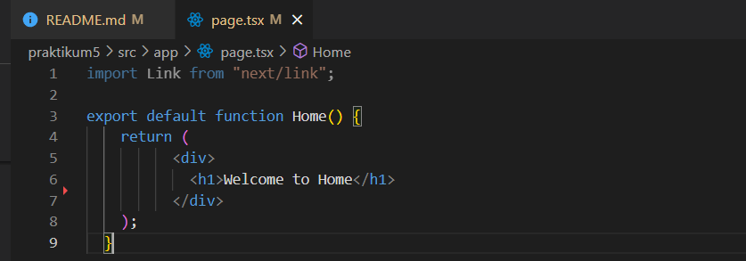

Layout

About Page
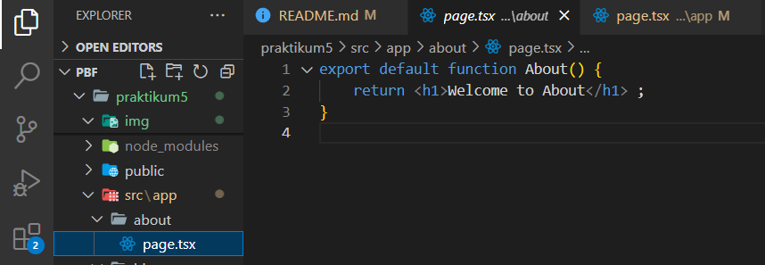
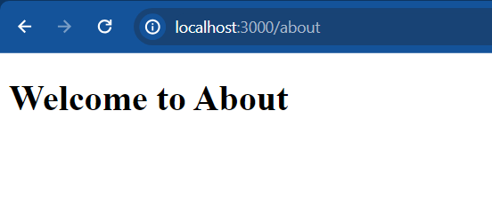

Profile page
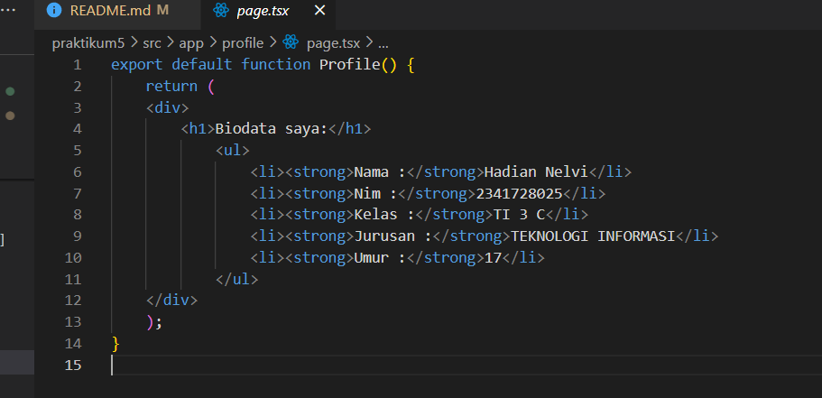
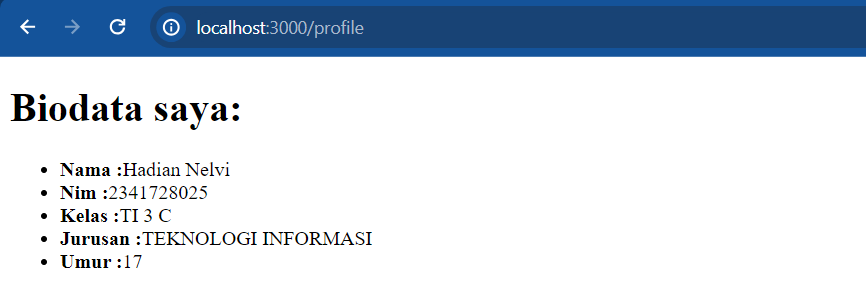

Praktikum 2
Blog page 
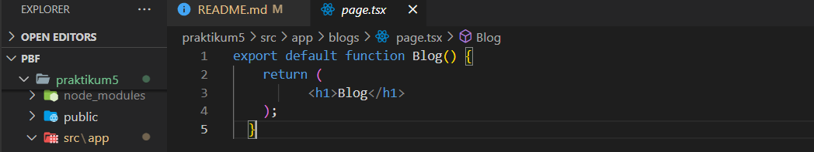
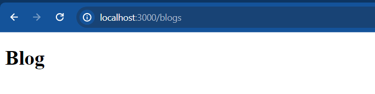

First blog
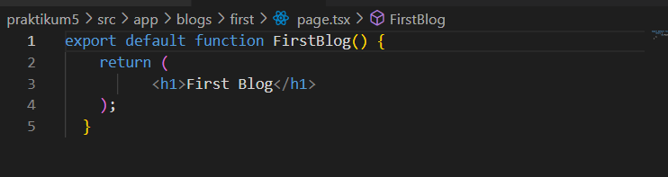
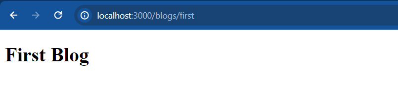

second blog
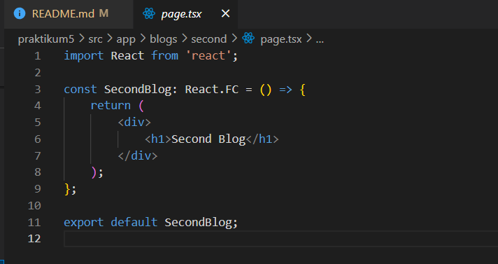
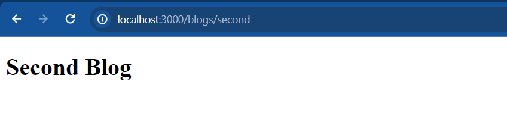

Kekurangan

Jika menggunakan konsep routing seperti praktikum 2, struktur folder menjadi kaku sehingga sulit diubah seiring perubahan aplikasi, selain itu jika ada perubahan struktur routing bisa jadi rumit dan memakan waktu yang banyak.

Praktikum 3
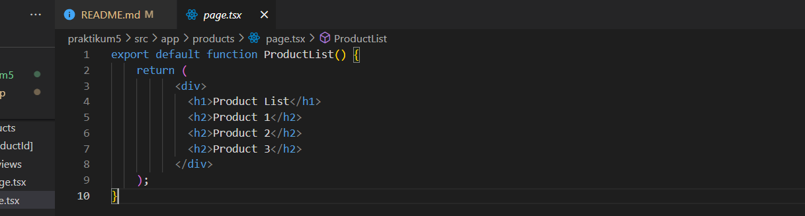
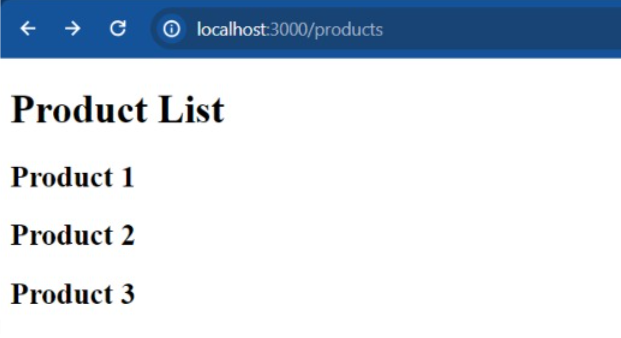
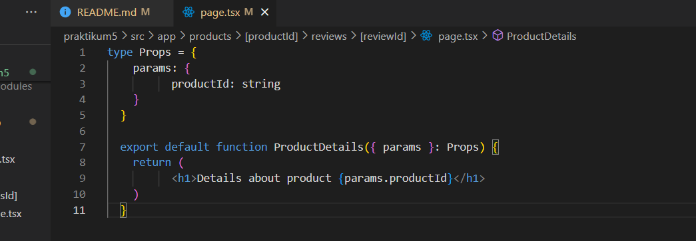
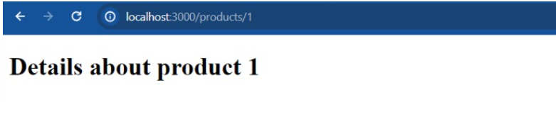

Todo1
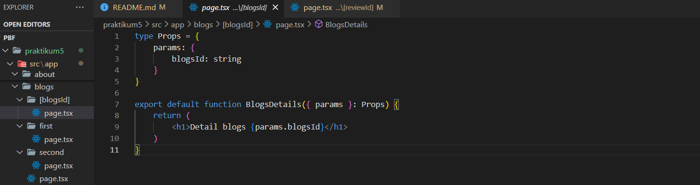
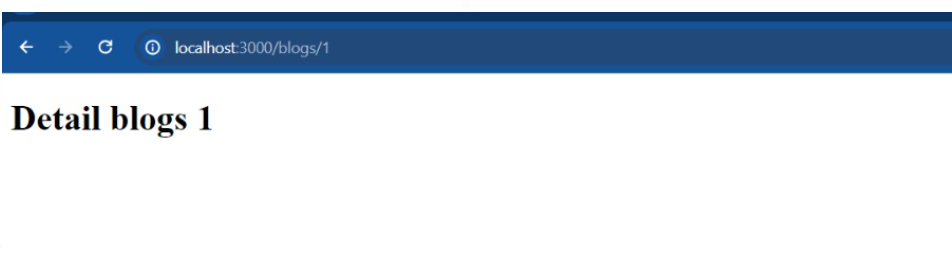

Todo2
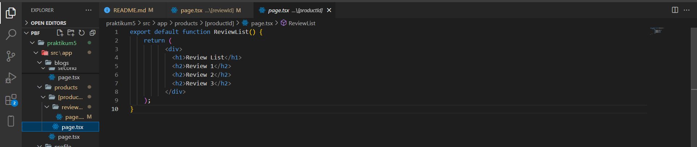
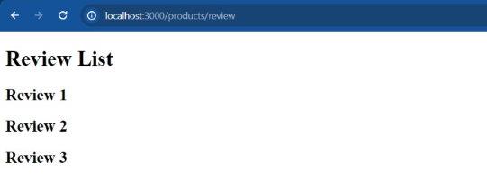

Praktikum4 dan Todo

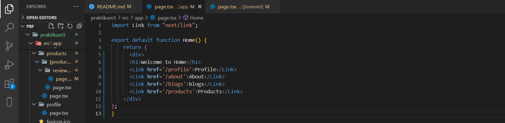
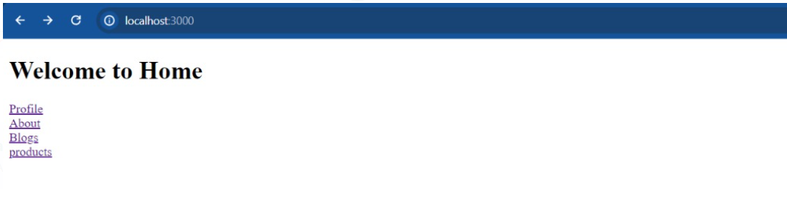

